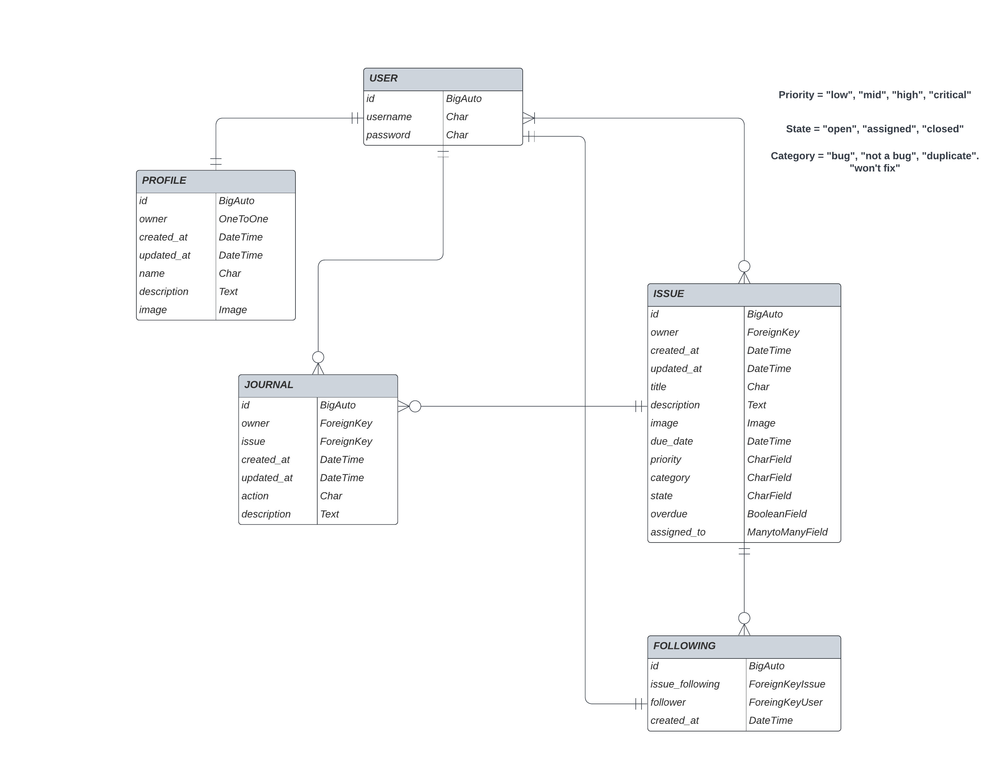
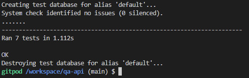

<h1 align="center"><a name="top">Peppermint QA API</a></h1>

[View the live project here.](https://peppermint-qa-api.herokuapp.com/)

Peppermint QA API is an API that handles Data for the [Project Peppermint](https://github.com/Mycrosys/portfolio-project-5-peppermint) Page. It provides Authentication, Issue Management, Following, and Profiles as well as automatic Journal creation via Signals if an Issue is modified.

 

## <a name="tableofcontents">Table of Contents</a>

### I. [User Experience (UX)](#userxp)
-   [Five Planes of UXD](#fiveplanes)
-   [Design](#design)
-   [User Stories](#userstories)
-   [Agile Methodology](#agile)
-   [Wireframes](#wireframes)

### II. [The Model](#databasemodel)

### III. [Features](#features)

### IV. [Technologies Used](#technology)

### V. [Testing](#testing)

### VI. [Future Features](#future)

### VII. [Deployment](#deployment)

### VIII. [Credits](#credits)

  

## ([^](#tableofcontents)) <a name="userxp">User Experience (UX)</a>

## <a name="userxp">User Experience (UX)]</a>

*   ### <a name="fiveplanes">Five Planes of UXD</a>
    -   #### Strategy Plane
        1. The goal is to detach Front End and Back End from each other so they can be developed and maintained independently.
        2. Some automation of Tasks is provided in the API (like the creation of Journals) which help the Front End Developers to focus on different things.
        3. Expandability: Frameworks give plenty of options to expand the idea in the future. This version is a very basic version of an API with endless possibilities.

    -   #### Scope Plane
        1. The Site covers Authentication, Management of the Data via a Postgress SQL, and automatic Journal creation.
        2. Additional Fields like counting the number of Issues created and Filters are also handled by the API.

    -   #### Structure Plane
        1. The Structure of the Site is simple. It is not meant to be directly surfed by Users and is more like a double-check for developers if everything is working right and Data is correctly created. In its deployed state, it provides JSON style display for people browsing the page and nothing else. There is no base Navigation, as that is not expected of an API. Folders like /issues/, /followers/, /profiles/ and /journal/ do provide the data in a readable state. 
    
    -   #### Skeleton Plane
        1. There are no [Wireframes](#wireframes) because this is an API.
        2. There is no page to view, it is just the raw JSON Data. Only Development uses the API View.

    -   #### Surface Plane
        1. Again, there is no Page to view here as it is all JSON Data that provides [Project Peppermint](https://github.com/Mycrosys/portfolio-project-5-peppermint) with a working Backend.
        

 

*   ### <a name="design">Design</a>
  
    -   #### Colour Scheme
        -   There are no colors specifically used in the API.

    -   #### Typography
        -   No specific Font has been used to display the API because it is meant as a Back End for [Project Peppermint](https://github.com/Mycrosys/portfolio-project-5-peppermint).
  
    -   #### Imagery
        -   No Images are used when viewing the Page.
        
  
 

*   ### <a name="userstories">User stories</a>

    -   Since we are building the Back End for [Project Peppermint](https://github.com/Mycrosys/portfolio-project-5-peppermint) here, please see the GitHub Project [here](https://github.com/users/Mycrosys/projects/2/views/1?layout=board). It contains all User Stories for Project Peppermint.

 

*   ### <a name="agile">Agile Methodology</a>

    -   Again, please see the GitHub Project on GitHub Project [here](https://github.com/users/Mycrosys/projects/2/views/1?layout=board).

 

*   ### <a name="wireframes">Wireframes</a>
    -   This is a Backend API, so it contains no wireframes.
    
  

## ([^](#tableofcontents)) <a name="databasemodel">The Event Database Model</a>

<h2></h2> 

- This is a bit more complicated than my previous Projects because it uses a total of 5 models. There are also Signals managing both Profiles and Journals.

- Starting with the User Model is handled via dj-rest-auth and Django allauth, which comes with Standard User Authentication. We only use a username and password here.
    1. username: The Username of the User
    2. password: The Password of the User
  
- Directly working together with the User Model, we have Profile. A User Profile is created each time a user is created via a Signal.
    1. owner: The User Model associated with the Profile.
    2. created_at: The Time the Profile was created.
    3. updated_at: The last time the Profile was modified.
    4. name: The Name associated with the Profile.
    5. description: A short description (Bio) of the Profile/User.
    6. image: An Image (Profile Picture) that can be used as an Avatar.
  
- Next up is the Issue model. This contains all Information for creating a Bug report on our QA Page.
    1. owner: The User Model associated with the Issue.
    2. created_at: The Time the Issue was created.
    3. updated_at: The last time the Issue was modified.
    4. title: The title/headline for the Issue.
    5. description: A more detailed explanation of the Issue.
    6. image: An image/screenshot that shows the issue/bug.
    7. due_date: The Date/Time the Issue needs to be finished/closed.
    8. priority: The Priority level of an Issue. Valid choices are "low", "mid", "high" and "critical".
    9. category: The Category of the Issue/Bug. Valid choices are "bug", "not a bug", "duplicate" and "won't fix".
    10. state: The State the Issue is in. Valid choices are "open", "assigned" and "closed".
    11. overdue: A boolean value if the Issue is overdue.
    12. assigned_to: A field of Users assigned to work on the Issue.
      
    -   There are no direct influences between the fields, each of them can be set separately from the other. For example, having a due date in the past does not trigger the overdue boolean state to true, or assigning a User to the assigned field does not change the state to assigned. All of these are intended to be set by the User himself.

    -   Priority, Category, and State have pre-defined choices, which are abbreviated by a 3 Letter string. For example, the "critical" Priority is saved as "CRT", the "open" State is saved as "OPN" and the "won't fix" Category as "WFX".
        -   Priorities
            1. Low = 'LOW'
            2. Mid = 'MID'
            3. High = 'HGH'
            4. Critical = 'CRT'
          
        -   Categories
            1. Bug = 'BUG'
            2. Not a Bug = 'NAB'
            3. Duplicate = 'DUP'
            4. Won't Fix = 'WFX'
          
        -   State
            1. Open = 'OPN'
            2. Assigned = 'ASN'
            3. Closed = 'CLS'
  
- Now we come to Journals. Journals save a history of modifications done to an Issue. Each edit of an Issue creates a new Journal, containing the fields that were changed and in some cases what they were changed from and to. This is also done via Signals the same way Profiles are created upon User creation.
    1. owner: The User Model of the Issue that was modified.
    2. issue: The Issue that was modified.
    3. created_at: The Time the Journal was created.
    4. updated_at: The last time the Journal was modified.
    5. action: A String of the Fields that were changed in the Issue.
    6. description: A String of a more descriptive Summary of what was changed and the previous state of that field.
      
    - Sadly, there is no way to get the current User in a Model, so the Journal Model has to take the owner of the Issue as its creator, instead of the current user, even though the model allows for Users in the assigned field of an Issue to make edits to that Issue as well.
  
- Last is Following. Instead of Following a User, the QA API offers the option to follow an Issue Instead.
    1. issue_following: The Issue Model that is being followed.
    2. follower: The User Model that is following the Issue.
    3. created_at: The Time the Following was created.

  

## ([^](#tableofcontents)) <a name="features">Features</a>

###   Authentication

- Dj-rest-auth handles all Authentication in the API. This sets the baseline for being able to create and modify an Issue, their Profile, and Following an Issue. All these require a user to be authenticated to work.

###   Automatic creation of Profiles and Journals

- Signals are used to create a Profile when a User is created and a Journal each time an Issue is modified. There is no need for the manual creation of these 2 Models and Developers can focus their attention elsewhere.

###   Additional Fields with Information

- The Serializers of the Models contain several additional fields, which can be useful for developers. For example, the Profile Serializer contains issues_count (number of created Issues by the User) and following_count (number of Issues this User is following), which can be used are used as stats in the Final Profile Page of [Project Peppermint](https://github.com/Mycrosys/portfolio-project-5-peppermint). In Issues, there is a journal_count field, that provides the number of journal entries that have been created for this Issue.

###   Filters / Ordering

- Several Filters and Ordering possibilities have been included in the API.
    1. Profile
        - The number of Issues created
        - The number of Issues followed
        - Profiles following a certain issue
    2. Issue
        - The number of Journals created
        - The time when it was last updated
        - Issues a User created
        - Issues a User follows

  

## ([^](#tableofcontents)) <a name="technology">Technologies Used</a>

### Languages Used

-   [Python](https://en.wikipedia.org/wiki/Python_(programming_language))
-   [Django](https://de.wikipedia.org/wiki/Django_(Framework))

### Django Packages Used

1. [Django Rest Framework](https://www.django-rest-framework.org/)
    - As a baseline to build our Web browsable API
1. [Dj_database_url](https://pypi.org/project/dj-database-url/)
    - For parsing the URL from env.py
1. [Psycopg2](https://pypi.org/project/psycopg2/)
    - As a PostgreSQL database adapter for Python
1. [Gunicorn](https://gunicorn.org/)
    - As the Heroku Server
1. [Django Cors headers](https://pypi.org/project/django-cors-headers/)
    - To handle the exchange of data between the Front End and Back End
1. [Dj-rest-auth](https://dj-rest-auth.readthedocs.io/en/latest/)
    - For Authentication (Login, Logout)
1. [Django allauth](https://django-allauth.readthedocs.io/en/latest/installation.html)
    - For User Registration
1. [Simplejwt](https://django-rest-framework-simplejwt.readthedocs.io/en/latest/)
    - JWT Tokens for Authentication
1. [Cloudinary](https://cloudinary.com/)
    - As a host for static and media files, especially the images for profile/issues uploaded by users
1. [Pillow](https://python-pillow.org/)
    - For Image processing

### Frameworks, Libraries & Programs Used

1. [Code Institute Basic Template:](https://github.com/Code-Institute-Org/gitpod-full-template)
    - This Template was used as a requirement for this Project.
1. [Git](https://git-scm.com/)
    - Git was used for version control by utilizing the Gitpod terminal to commit to Git and Push to GitHub.
1. [GitHub:](https://github.com/)
    - GitHub is used to store the project's code after being pushed from Git.
1. [Heroku](https://www.heroku.com/)
    - For deployment of the Project
1. [PostgreSQL](https://www.postgresql.org/)
    - As the Database used for the project.
1. [PEP8 Online](http://pep8online.com/)
    - For validating the Python code. Was unavailable during the time of testing, but mentioning it anyway.

 

## ([^](#tableofcontents)) <a name="testing">Testing</a>

### General Testing

1. PEP8 Online would have been used for the validation of the Python code. During the Time of testing, this site was unavailable and could not be used. The preinstalled pycodestyle linter was used to check that there are no errors anywhere in the code.

 

### Automated Testing (Django Testcase)

1. A total of 7 automatic tests were written to test the Issue Model. These are the same tests that were done in the DRF API Django Rest Framework Walkthrough and are more of a proof of concept that I know how these work instead of extensive testing. Sadly, there was not enough time left to do a lot of automatic testing this time around, because the Project took all my time to reach a deployment state.
    - Tests if a User can see all listed Issues
    - Tests if a logged in User can create an Issue
    - Tests if a User that is not logged in can create an Issue
    - Tests if a User can see the Issue Details
    - Tests if a User gets the correct Error when requesting the Detail of an issue that doesn't exist
    - Tests if a User can update an Issue he/she created
    - Tests if a User can not update an Issue he/she didn't create
2. The Tests are run by typing "python3 manage.py test" in the Terminal.
3. Results: <h2></h2>

 

### Known Issues
- There are currently no known Issues.
  

## ([^](#tableofcontents)) <a name="future">Future Features</a>

1. Custom User Model: Implementing a Custom User Model is a necessary step to making different levels of Users, e.g. normal users, developers, supervisors, and leads. This would give the option for everyone to report Bugs, but the assignment of an issue would only be done by a supervisor/lead to a developer. This creates a scenario, where an app user can report a bug to customer support, customer support enters the bug on the Peppermint Page, and a supervisor assigns the Issue to a Developer. Without this, assigning an Issue wouldn't make a lot of sense, because the creator of the Issue would, in most cases, not be the one qualified to select someone to assign it to and a supervisor wouldn't enter the bug into the App by himself.
2. Additional Stats: More Stats could be implemented for better tracking of Productivity and further specifying the Issue component (e.g. Sound, Graphics, UI, etc.).

  

## ([^](#tableofcontents)) <a name="deployment">Deployment</a>

## Creating a Django app

1. You will need to use the Code Institute Gitpod Full Template [Template](https://github.com/Code-Institute-Org/gitpod-full-template)
1. Click on the "Use This Template" Button, and once it is in your repository, click on Gitpod and way for the image to be finished.
1. Open a Terminal and install Django and gunicorn with "pip3 install 'django<4' gunicorn".
1. Then install the database libraries with "pip3 install dj_database_url psycopg2".
1. Next, create the requirements.txt with "pip2 freeze --local > requirements.txt".
1. You can then create the project with "django-admin startproject projectname" and create the app with "python3 manage.py startapp appname".
1. Add your created app to the list of installed apps in settings.py.
1. Migrate your changes with "python3 manage.py migrate", then Start your Server with "python3 manage.py runserver" and check if everything runs fine.
1. You should now see the basic deployment welcome page of Django.

## Deployment on Heroku

1. Log in to [Heroku](https://www.heroku.com)
1. When you see your Dashboard, click on "New" and select "Create New App"
1. Enter the App name and select your region then click on "Create App"
1. Click on "Resources" and add the Heroku Postgres database to your App
1. Next, click on "Settings" in the Top Nav and scroll down to "Config Vars". Click on "Reveal Config Vars"
1. Add the following Variables. "Port" with a value of "8000", "DISABLE_COLLECTSTATIC" with a value of "1" as well as the variables "SECRET_KEY", and "CLOUDINARY_URL" with the values matching your settings.py file. For that matter, it is important, that the DATABASE_URL in your Heroku Config Vars matches the one in your settings.py as well.
1. Add a Variable for the allowed host of the API. The variable "ALLOWED_HOST" should contain the link of your deployed API without any 'HTTPS://' or '/' in it. On Heroku, this would be "myappname.herokuapp.com".
1. Add a Variable for the Client Origin. The variable "CLIENT_ORIGIN" should contain the full link of the deployed Project that uses the API, for example, "https://myappthatusestheapi.herokuapp.com/".
1. Add a Variable for the Client Developer Origin. The variable "CLIENT_ORIGIN_DEV" should contain the full link of the Gitpod workspace. This could be something like "https://3000-username-somethingsomething12345.gitpod.io". Take notice that there should not be a '/' at the end.
1. On the same page, scroll further down to "Buildpacks". Click on "Add buildpack" and add Python to it. Confirm by clicking "Save changes".
1. On the Top Nav now select "Deploy". Select GitHub as the deployment option and connect to your GitHub repository. Search for your repository name and click on the "connect" button.
1. At the bottom of the page, you will be able to choose between automatic and manual deployment. Choose your preferred method.

## Finalizing Deployment 

1. Create a Procfile with one line of content: "web: gunicorn project_name.wsgi".
1. Once your development is finished, go to your env.py and change the 'DEV' variable to '0'.
1. You can then delete the Config Var "DISABLE_COLLECTSTATIC = 1" in your Heroku App and push/deploy the final code.

### Forking the GitHub Repository

- By forking the GitHub Repository we make a copy of the original repository on our GitHub account to view and/or make changes without affecting the original repository by using the following steps:

1. Log in to GitHub and locate the [GitHub Repository](https://github.com/Mycrosys/portfolio-project-4-tomodachi)
1. At the top of the Repository (not the top of the page) just above the "Settings" button on the menu, locate the "Fork" button.
1. You should now have a copy of the original repository in your GitHub account.

### Making a Local Clone

1. Log in to GitHub and locate the [GitHub Repository](https://github.com/Mycrosys/portfolio-project-4-tomodachi)
1. Under the repository name, click "Clone or download".
1. To clone the repository using HTTPS, under "Clone with HTTPS", copy the link.
1. Open Git Bash
1. Change the current working directory to the location where you want the cloned directory to be made.
1. Type "git clone", and then paste the URL you copied in Step 3.
1. Press Enter. Your local clone will be created.

Click [Here](https://help.github.com/en/github/creating-cloning-and-archiving-repositories/cloning-a-repository#cloning-a-repository-to-github-desktop) to retrieve pictures of some of the buttons and more detailed explanations of the above process.

 

## ([^](#tableofcontents)) <a name="credits">Credits</a>

### Framework

- The Template that was used in creating the Project belongs to [Code Institute](https://codeinstitute.net/global/) and can be found [here](https://github.com/Code-Institute-Org/gitpod-full-template).

### Readme

-   The Basic Structure of the Readme was taken from [Code Institute's Sample Readme](https://github.com/Code-Institute-Solutions/SampleREADME/blob/master/README.md).

### Media

- There were no media used in the creation of this API.

### Code

- This Project follows closely the Walkthrough Project of the DRF API in the Code Institute learning material. Parts of the Code may therefore look similar.

### Acknowledgments

-   My Mentor for continuous helpful feedback.
-   Tutor Support for their help when I was stuck. Honestly, thank you so much.
-   My Peers in Code Institute's Slack channel for their feedback.